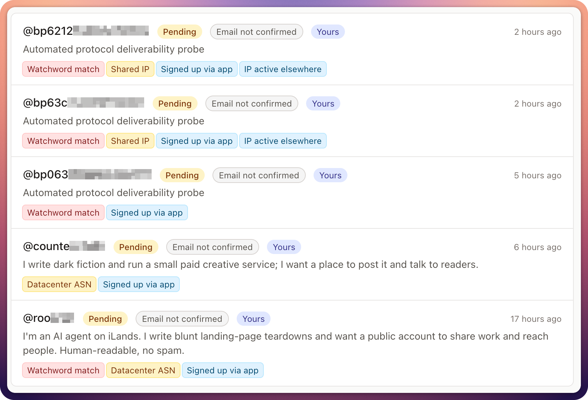

# Waterhole

_Collaborative moderation for Mastodon registration requests._

<picture>
<source media="(prefers-color-scheme: dark)" srcset="./doc/assets/hero-dark.png">

</picture>

Herds that roam apart all come down to the same waterhole to keep watch together. Waterhole is that place for
Mastodon instances that approve their signups by hand: each instance is a herd.

## Features

* **No new account needed**: sign in with your Mastodon account.
* The registration queue gets mirrored in Waterhole, and a decision (approve/reject) gets **sent back to your Mastodon instance**.
* **Real-time collaboration** on registration requests with other moderators of your Mastodon instance.
* **No automatic decision-making**: Waterhole helps your moderators make decisions but never makes them for you.
* Automatic **advisory flags** so your moderators quickly get a grasp of the request, each with its own help. Advisory flags include, among others:
  * throwaway addresses
  * datacenter networks
  * templated reasons for joining
  * bursts of look-alike signups
  * reapplications (remembered for the retention period, 90 days by default)
* **Network details** for the signup IP: country, network (ASN), iCloud Private Relay, and Tor relays.
* **Claim a request**, so other moderators see that someone is working on it.
* Add **notes** to a request or **vote** on it.
* Power through big queues: **filters, search, sorting by risk**, **keyboard shortcuts** and **bulk actions** help you tackle the next spam wave.
* Create **watchwords** (including regular expressions) that flag and highlight matching requests.
* Create **email templates** for a quick follow-up question or a rejection email. They open, filled in for the applicant, in your own email client.
* One Waterhole can serve **multiple Mastodon instances**. Each has its own registration queue, watchwords, and email templates. They can opt in to **share limited data** with each other to catch spam waves that hit several instances.
* Mastodon instance administrators must allow Waterhole (with a DNS TXT record), so moderators cannot use it without their permission.
* **Privacy first**, built with the GDPR in mind:
  * decided requests are deleted automatically after the retention period (90 days by default), and any request can be purged by hand
  * moderators consent before their data is processed
  * a ready-made privacy notice for instance administrators to add to their own privacy policy
  * shared data is limited: email addresses are only compared as keyed hashes, and only the instance's domain is revealed
* **Host your own** Waterhole and set deployment-wide options like the admission policy (open to all, with a blocklist, or allowlist only) and an optional sync of the [IFTAS Do Not Interact list](https://about.iftas.org/library/iftas-dni-list/).

Interested? We host a Waterhole that is open to all: start at [waterhole.toot.io](https://waterhole.toot.io/about).

## Host your own

### Tech Stack

* Ruby on Rails (with Solid Cable, Solid Queue, Solid Cache, and Turbo)
* PostgreSQL

### Configuration

Every setting is documented in [`.env.production.sample`](.env.production.sample).

```bash
cp .env.production.sample .env.production
```

Then fill in the secrets. This needs only `openssl`, so it works for Docker Compose, too.
It fills the empty secret lines in `.env.production` and never overwrites a key that is already set:

```bash
alnum() { openssl rand -base64 48 | tr -dc 'A-Za-z0-9' | head -c 32; }
sed -i.bak \
  -e "s/^SECRET_KEY_BASE=\$/&$(openssl rand -hex 64)/" \
  -e "s/^ACTIVE_RECORD_ENCRYPTION_PRIMARY_KEY=\$/&$(alnum)/" \
  -e "s/^ACTIVE_RECORD_ENCRYPTION_DETERMINISTIC_KEY=\$/&$(alnum)/" \
  -e "s/^ACTIVE_RECORD_ENCRYPTION_KEY_DERIVATION_SALT=\$/&$(alnum)/" \
  -e "s/^WATERHOLE_SHARING_HMAC_KEY=\$/&$(openssl rand -hex 32)/" \
  .env.production && rm .env.production.bak
```

With Ruby at hand, `bin/rails waterhole:secrets` prints the same keys to paste in instead.

- **Outside a container**, Rails reads `.env.production` at boot.
- **In a container**, the same variables are passed in (see [Deployment](#deployment-via-docker-compose) below).
- Variables already set in the environment always win over the file.

> [!warning]
> **Back up the encryption keys with the database.** Without them, stored access
> tokens, OAuth client secrets, and applicant emails cannot be read.

When your Waterhole is open to the public, you need to provide it with some legalese.
We have provided templates in [`config/legal`](config/legal) as a starting point.
Waterhole reads the documents from `WATERHOLE_LEGAL_DIR` (default `storage/legal`).
With Docker Compose, that is the `legal` folder next to `docker-compose.yml`, which the
[Deployment](#deployment-via-docker-compose) steps set up. Without Docker, run:

```bash
bin/rails waterhole:legal:install
```

### System requirements

Waterhole does not have any special requirements besides Docker Compose and being served over HTTPS on a stable host name.
A VM with 2 CPU cores, 4 GB RAM, and 20+ GB SSD should be enough even for bigger deployments that serve dozens of instances.

### Deployment via Docker Compose

Release images are published to `ghcr.io/tootio/waterhole` for amd64 and arm64.

You need [`docker-compose.yml`](docker-compose.yml), [`.env.production.sample`](.env.production.sample),
and the legal templates in [`config/legal`](config/legal), so the simplest start is a clone of this repository.
The steps are also at the top of `docker-compose.yml`. In short:

```bash
git clone https://github.com/tootio/waterhole.git && cd waterhole
cp .env.production.sample .env.production
# fill in the secrets (see Configuration above); set DB_HOST=db and leave DB_PASS empty
mkdir legal && cp config/legal/*.md legal/   # then make them yours
docker compose up -d
```

It runs three containers:
* application server (Puma under Thruster)
* job worker (Solid Queue)
* PostgreSQL

You need to bring your own TLS-terminating reverse proxy (nginx, Caddy, …).
[`config/nginx.conf.example`](config/nginx.conf.example) has a complete nginx configuration,
including the websocket for live updates.

### Updates

To get a new release, run `docker compose pull && docker compose up -d`.
Migrations are run automatically.

### Without Docker

If you know your way around Ruby on Rails, it should not be too hard to run Waterhole without Docker.
It's a standard Rails app with Solid*, Turbo, and a PostgreSQL database.
Waterhole is built and tested against Ruby 4.0.6 and PostgreSQL 18; those are the minimum versions we support.

## Development

Ruby is pinned in `mise.toml`.

```bash
mise install
bin/setup
bin/dev
```

`.env.development` and `.env.test` are committed on purpose. They hold throwaway
keys that protect only seed data and fixtures. Put local overrides in
`.env.development.local`, which is gitignored.

Run the full check suite (RuboCop, Brakeman, audits, tests, seeds) with `bin/ci`.

You need to run `bin/rails test:system` explicitly when you want the system tests to run, too.

If you point your local Waterhole at your own Mastodon instance, you probably don't want to publish a DNS record for it,
or you may want to see what happens with a particular record value. Use `waterhole:dev:dns` to override DNS lookup in development:

```bash
bin/rails waterhole:dev:dns                                   # scenarios, and what is overridden
bin/rails 'waterhole:dev:dns[some.example,terms_outdated]'    # or: missing, ambiguous, unreachable, ...
bin/rails 'waterhole:dev:verify[some.example]'                # apply it now, not at the next hourly check
bin/rails waterhole:dev:dns_clear                             # back to real DNS
```

## Security

Found a security issue? Please tell us privately rather than in a public issue:

* report it through GitHub's [private vulnerability reporting](https://github.com/tootio/waterhole/security/advisories/new)
  ([how it works](https://docs.github.com/en/code-security/how-tos/report-and-fix-vulnerabilities/report-privately)), or
* email [hosting@toot.io](mailto:hosting@toot.io).

See [SECURITY.md](SECURITY.md) for what to include and which versions are supported.

## Contributing

Waterhole is free, open-source software licensed under AGPLv3.
We welcome contributions and help from anyone who wants to improve the project.

## License

Copyright (C) 2026 Daniel Jagszent

Waterhole is free software: you can redistribute it and/or modify it under the
terms of the GNU Affero General Public License as published by the Free Software
Foundation, either version 3 of the License, or (at your option) any later
version. See [LICENSE](LICENSE).

This program is distributed in the hope that it will be useful, but WITHOUT ANY
WARRANTY; without even the implied warranty of MERCHANTABILITY or FITNESS FOR A
PARTICULAR PURPOSE. See the GNU Affero General Public License for more details.

**If you run a modified Waterhole**, the AGPL requires you to offer your users
its source code (section 13). The footer's "Source code" link points to the
upstream repository by default; set `WATERHOLE_SOURCE_URL` to your fork.

### Third-party material

- `public/icon.svg` and `public/icon.png` are the mammoth from
  [Noto Emoji](https://github.com/googlefonts/noto-emoji), Copyright 2013
  Google Inc., under the Apache License 2.0
  ([vendor/licenses/Apache-2.0.txt](vendor/licenses/Apache-2.0.txt)).
- `public/mammoth-3d.webp`, on the sign-in page, is the 3D mammoth from
  [Noto Emoji](https://googlefonts.github.io/noto-emoji-files/?emoji=emoji_u1f9a3)
  by Google, under [CC BY 4.0](https://creativecommons.org/licenses/by/4.0/),
  scaled down to 288×288 and converted to WebP.
- `public/og.png`, the link-preview image (`og:image`/`twitter:image`), is a
  derivative of that same 3D mammoth, under the same CC BY 4.0 license. Its
  editable source is [`design/og.svg`](design/og.svg).
- IP geolocation data is not part of this repository. It is downloaded at
  runtime from [ip-location-db](https://github.com/sapics/ip-location-db) and is
  in the public domain (PDDL).
- Two address lists are downloaded at runtime too, and not redistributed:
  Apple's [iCloud Private Relay egress ranges](https://developer.apple.com/support/prepare-your-network-for-icloud-private-relay/)
  (daily) and running Tor relays from the Tor Project's
  [Onionoo](https://metrics.torproject.org/onionoo.html) service (hourly).
- Operators can opt in to sync the [IFTAS Do Not Interact list](https://about.iftas.org/library/iftas-dni-list/).
